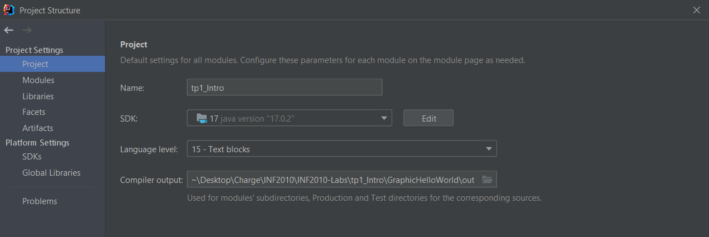
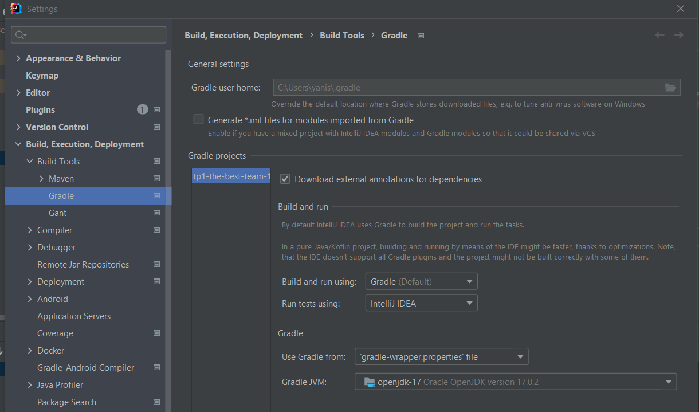

------------------------------------------------------------------------


<td><h1>INF2010 - Structures de données et algorithmes</h1></td>

Merci au cours INF3500 pour le format du Markdown

------------------------------------------------------------------------

Travail pratique \#1
====================

Introduction à Java
=============================================================

Objectifs
---------
* Apprendre les bases de programmation en Java

* Utiliser le polymorphisme, l’agrégation et la composition

* Utiliser des patrons de conception comme le [Fluent](https://en.wikipedia.org/wiki/Fluent_interface) et
  [Factory](https://refactoring.guru/design-patterns/factory-method)

Préparation au laboratoire
--------------------------
Pour ce laboratoire, il est recommandé d’utiliser l’[IDE IntelliJ](https://www.jetbrains.com/fr-fr/idea/download/)
offert par JetBrains. Vous avez accès à la version complète (Ultimate) en tant qu’étudiant à Polytechnique Montréal.
Il suffit de vous créer un compte étudiant en remplissant le [formulaire d'inscription étudiante](https://www.jetbrains.com/shop/eform/students).

Pour les étudiants utilisant **Linux**, il vous faudra installer le package tesseract-ocr-fra. Un tutoriel de base se trouve [ici](https://linuxhint.com/install-tesseract-ocr-linux/). 

Astuces
-------
### Gradle
Le projet utilise Gradle pour gérer les *builds*. Après ouverture du projet, il est nécessaire d'importer le projet
Gradle à l'aide d'une fenêtre qui apparaîtra en bas à droite de votre écran.


Dans le cadre du laboratoire, les différentes *build configurations* nous permettront de générer des programmes
contenant les tests implémentés à l'aide de [JUnit](https://junit.org/junit5/).

### Configuration Java
Afin que le TP compile sans erreurs, vous devez vous assurer d'utiliser la version 17 de Java SDK.
Pour ce faire aller dans File -> Project Structure. Ensuite, sous project SDK assurez-vous d'avoir
openjdk-17. Il est possible de l'installer avec Intellij en ouvrant le *dropdown* SDK puis en allant sur *Add SDK* et en cliquant sur *Download SDK*. Vous devrez aussi
sélectionner **15-Text blocks** comme **Project language level**.



### Exécution Individuelle des tests
Afin de pouvoir lancer les tests de manière individuelle, il faut vous assurer que votre configuration soit la suivante.
Aller dans File -> Settings -> Build, Execution, Deployment -> Build Tools -> Gradle. Assurer vous que vous avez
sélectionné **IntelliJ IDEA** dans la section **Run tests using** et que votre **Gradle JVM** soit **openjdk-17**



##### *Build configuration* pour tous les tests (ou un dossier en particulier)


##### *Build configuration* pour une classe en particulier


##### *Build configuration* pour un test en particulier


### Java

Pour ce laboratoire, il est suggéré d'apprendre à utiliser les `streams` de Java. Vous pouvez trouver plus d'information
[ici](https://winterbe.com/posts/2014/07/31/java8-stream-tutorial-examples/). À noter que tout le laboratoire peut très
bien se réaliser sans ceux-ci.

------------------------------------------------------------------------

Partie 1 : Point
---------------
Un point est une structure de données représentant une donnée spatiale de dimension quelconque.
Celle-ci sera utile pour créer des formes qui sont la résultante de la composition de plusieurs points.

L'objectif de cette partie est de faire passer les tests de chacune des classes associées aux points.
Pour limiter la duplication de code, il est recommandé de faire passer les tests dans l'ordre suivant :

##### 1. PointOperatorTest
##### 2. Point2dTest

Pour bien implémenter chaque partie, suivez les tests de chaque fichier dans leur ordre de définition.

------------------------------------------------------------------------
Partie 2: Interfaces
---
Une interface définit un ensemble de signatures. Chaque classe qui implante ("implements") une interface doit fournir le code pour toutes les signatures de l'interface en question.

2 interfaces sont à créer dans ce TP:

#### 1. Rotate
#### 2. Translate

Vous devez les déclarers et les implémenter dans la classe Transform. 
#### Vous devez utliser les fonctions implémenter dans transform pour les parties suivantes.

------------------------------------------------------------------------
Partie 3 : Formes
----------------
Une forme est représentée par une composition de points. Dans notre cas, seulement les formes à deux dimensions
nous intéressent. Les formes qui nous intéressent sont des polygones bien définis par des équations mathématiques (carré, cercle, etc.).

##### Chaque forme doit remplir les critères suivants:
* Centrée à l'origine
* Les points recouvrent la surface (aire) de la forme
* Les points sont espacés de 0.5 pixel (facteur d'incrémentation)

L'objectif de cette partie est de faire passer les tests de chacune des classes associées aux formes. Pour limiter la
duplication de code, il est recommandé de faire passer les tests dans l'ordre suivant :

##### 1. BaseShapeTest
##### 2. ShapeTest

Pour bien implémenter chaque partie, suivez les tests de chaque fichier dans leur ordre de définition.

------------------------------------------------------------------------

Partie 4 : Lettres
-----------------
Une lettre est une composition de formes simples. Un patron de conception
[Factory](https://refactoring.guru/design-patterns/factory-method) légèrement simplifié est utilisé pour générer un
ensemble de lettres spécifique qui permettra la génération de l'image suivante (les couleurs sont générées aléatoirement) :


Une librairie d'*Optical Character Recognition (OCR)* est utilisée pour détecter si votre image affiche bien la phrase
« BONNE CHANCE ». Les tests demandent que la librairie soit capable de détecter au moins 50 % des caractères présents.
Cependant, la librairie est parfois capricieuse et tout les points seront donc accordé dans deux cas :
**Soit l'image créée est bien détectée par la librairie d'OCR, soit votre image forme des lettres bien définies.**

On ne sera pas sévère sur le « bien défini », si vous vous rapprochez de l'image fourni dans le README.md, ça ne sera pas un problème.
On ne répondra pas aux questions qui cherchent à faire valider leur image.

Pour bien implémenter les lettres, suivez les tests du fichier `LetterTest.java`.

------------------------------------------------------------------------

Barème de correction
--------------------

|||
|---------------------------|----------|
| Conformité du code     	|   /10    |
| Désign du code            |   /5     |
| Implémentation du code    |   /5     |
| Total                     |   /20    |
||

**Correction automatique** : Les tests sont un bon moyen d'évaluer votre note avant la remise. Néanmoins, l’entièreté
de votre code sera révisée par un chargé de laboratoire pour s'assurer qu'il réalise véritablement les tâches demandées.
Il peut donc y avoir des différences entre la note donnée par vos tests et votre note finale.

### Qu'est-ce que du code de qualité ?
Veuillez visiter [ce lien](https://docs.google.com/document/d/12YDr57UofDKu5mCJBSYhOQ1yibLu6K0s8xAbMj3_SGg/edit?usp=sharing) pour voir des erreurs communes à éviter. 
* Absence de code dédoublé (FAITES DES FONCTIONS!!!)
* Absence de *warnings* à la compilation
* Absence de code mort : Code en commentaire, variable inutilisé, etc...
* Respecte les mêmes conventions de codage dans tout le code produit
  * Langue utilisée
  * Noms des variables, fonctions et classes
* Variables, fonctions et classes avec des noms pertinents et clairs qui expliquent leur intention et non leur comportement
* Pas de code du type :
```java
class Example {
  //Exemple de mauvais code
  private static boolean foo(Integer x) {
    if (x > 10)
      return true;
    else
      return false;
  }

  //Exemple de bon code
  private static boolean foo(Integer x) {
    return x > 10;
  }
}
```
**Petite astuce:** Utiliser les fonctionnalités offertes par Intellij!

Le dernier commit de votre répertoire sera utilisé comme remise finale. Chaque jour de retard créera une pénalité
additionnelle de 20 %. Aucun travail ne sera accepté après 4 jours de retard.

