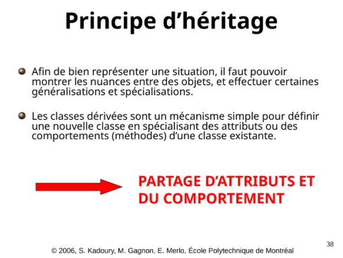
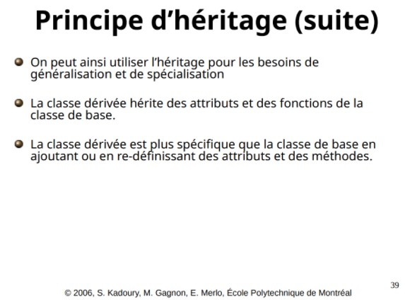
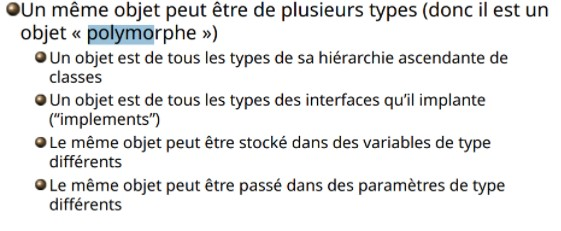

------------------------------------------------------------------------

<td><h1>INF2010 - Structures de données et algorithmes</h1></td>

------------------------------------------------------------------------

Travail pratique \#2
====================

Tables de hachage
=============================================================

Objectifs
---------
* Apprendre le fonctionnement d’une table de hachage

* Comprendre la complexité asymptotique d’une table de hachage

* Utiliser les principes de l'héritage et du polymorphisme

Introduction
--------------------------
L'héritage est la bonne pratique à utiliser pour partager les méthodes et les attributs d'une classe de base aux sous-classes.

Le polymorphisme est la bonne pratique à utiliser pour le changement dynamique du comportement d'une méthode .

Partie 1 : Implémentation des tables de hachage
---------------
Une table de hachage est une structure de données qui utilise une fonction de dispersement (fonction de hashage) pour donner une valeur numérique à une clé qui peut être d’un type quelconque (string, int, MyCustomClass, ..). Cette valeur numérique retournée par la fonction de dispersement est utilisée comme indice dans un tableau.

Il arrive que la fonction de dispersement retourne la même valeur numérique pour deux clés différentes. Ce phénomène nommé « collision » est un problème connu des tables de hachage et plusieurs techniques existent pour pallier à ce problème. Dans le cadre de ce laboratoire, vous implémenterez trois types de tables de Hashage :

En vous basant sur les informations données dans l'introduction et l'implémentation de la Quadratic Probing HashTable dans le livre de Weiss (https://users.cs.fiu.edu/~weiss/dsaajava2/code/QuadraticProbingHashTable.java)
On vous demande d'implémenter les trois tables de hachage suivantes :

- Table à sondage linéaire
- Table à sondage quadratique
- Table à dispersement double

On résout les collisions au moyen de séries de fonction de hachages position= H(x) + f(i) où H(x) est la méthode myhash()
régulière qu'on utilise dans le code.

-Sondage linéaire : f(i) = i
-Sondage quadratique : f(i) = i²
-Dispersement double : f(i) = i*H2(x) où H2(x) = R-(x.hashCode()%R) et R est le plus grand nombre premier plus petit que la taille de la table.

Vous devez commencer un "New Project" dans l'environnement Intellij idea, aucun fichier Test n'est nécessaire.
Vous pouvez prendre les mêmes configurations du TP1 pour le JDK

Il est recommandé de revoir les notes de cours et le code de base pour comprendre la conception de la table.

------------------------------------------------------------------------

Partie 2 : Questions
----------------
Après avoir complété la partie 1 qui est nécessaire pour faire cette partie :

Créer un fichier "main.java" avec une classe "public class main" qui contient une méthode
"public static void main (String args[]) {}"

Pour cette partie, il est demandé de prendre des captures d'écrans des résultats obtenus.

a) Nombre de Conflits

- Définir une instance de type interface pour chacune des trois classes de tables que vous avez implémentées.
- Pour chaque instance, insérer tous les éléments des tableaux qui vous sont donnés dans le fichier Arrays dans votre table, un tableau à la fois.
- Pour chaque instance de table et chaque tableau d'éléments, mesurer la taille (Min,Max et Moyenne) des amas (positions contigues remplies). Mettez vos observation dans un tableau dans votre rapport
- Pour chaque instance de table et chaque tableau d'éléments, compter le nombres de conflits qui ont eu lieu et enregistrer le temps pris pour l'exécution. Mettez vos observations dans le même tableau et expliquez brièvement les résultats.
- De vos observations, est-ce que la complexité temporelle de l'insértion d'un nombre N d'éléments pour chacune des trois tables est conforme à la théorie ? Expliquez brièvement les résultats.

b) Load Factor
- Reprendre les mêmes étapes de la partie a) avec 0.25 et 0.75 comme load Factor. ( Enregistrer seulement le nombres de conflits)
- Afficher vos observations dans des tableaux dans votre Rapport.
- Comparer ces deux Tableaux au Tableau de la partie a)
- Que constatez-vous au niveau de la relation du Load Factor et du nombre de conflits?

c) Rehash
- Quelle est la complexité asymptotique de l'opération du Rehash?
- Suspendre le Rehash de votre code, et répéter les mêmes étapes de la partie a)
- Comment a varié le temps d'exécutions et le nombre de conflits par rapport au tableau de la partie a)? Pourquoi?

Remarque : Vous devez remettre le code à son état initial (avant la partie 2) pour la remise, tout changement fait pour la partie 2 doit être cité ou pris en capture d'écran.

Astuces : Vous pouvez utiliser la fonction System.nanoTime() avant et après une opération et calculer la différence pour avoir le temps passé en nanosecondes.

-------------------------------------------------------------------------
##  Partie 3 : Rapport ##

Vous devez rédiger un rapport et le remettre en format pdf.
Ce rapport contiendra vos tableaux, captures d'écrans et réponses aux questions.
Le rapport doit être nommé sous la forme Matricule1_Matricule2.pdf

------------------------------------------------------------------------
Barème de correction
--------------------
||||
|-----------------|-----------------------------|-----|
| **Partie 1**        | Implémentation des Tables   | /5  |
|                 | Design et Qualité du code   | /4  |
| **Partie 2**        | Captures d'écrans           | /2  |
|                 | Tableaux                    | /4  |
|                 | Réponses aux Questions      | /5  |
| Total           |                             | /20 |

------------------------------------------------------------------------

##### Qu'est-ce que du code de qualité ?
* Absence de code dédoublé (Utilisez de facon appropriée l'héritage et les interfaces en Java).
* Absence de *warnings* à la compilation
* Absence de code mort : Code en commentaire, variable inutilisé, etc...
* Respecte les mêmes conventions de codage dans tout le code produit
    * Langue utilisée
    * Noms des variables, fonctions et classes
* Variables, fonctions et classes avec des noms pertinents et clairs qui expliquent leur intention et non leur comportement

Le dernier commit avant la date d'échéance de votre répertoire sera utilisé comme remise finale.
verifiez que le contenu du commit soit bel est bien enregistré, pour éviter des erreurs de soumission.
Au cas d'absence de commits, un jour de retard entraine une pénalité de 20%. Aucune remise n'est acceptée après 4 jours de retard.

