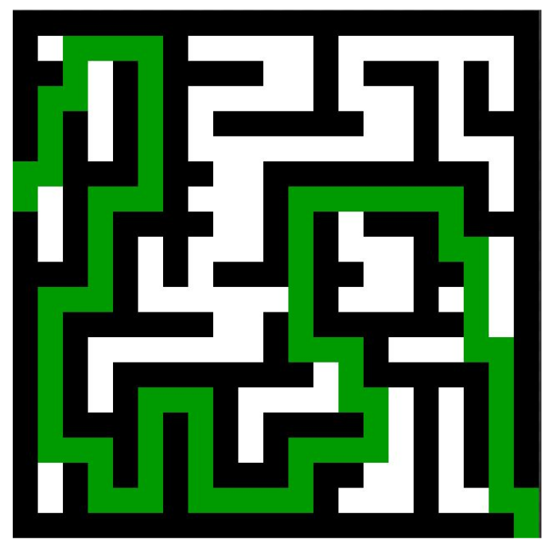
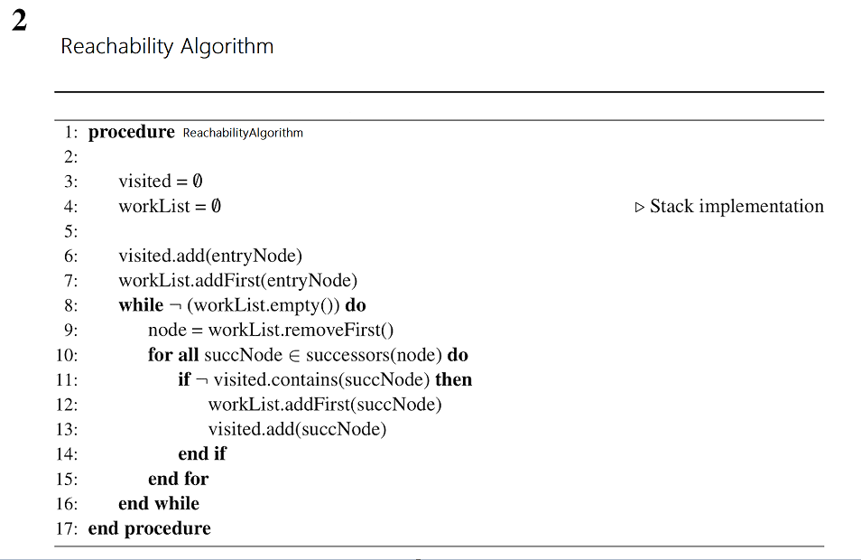

------------------------------------------------------------------------

<td><h1>INF2010 - Structures de données et algorithmes</h1></td>

Merci au cours INF3500 pour le format du Markdown

------------------------------------------------------------------------

Travail pratique \#5
====================

*Graphes*
=============================================================

Objectifs
---------
* Apprendre le fonctionnement d’un *graphe*

* Comprendre la complexité temporelle et spatiale d’un
  algorithme qui utilise des *graphes*

* Utiliser les concepts associés aux graphes dans des problèmes
  complexes

Préparation au laboratoire
--------------------------
Pour ce laboratoire, il est recommandé d’utiliser l’[IDE IntelliJ](https://www.jetbrains.com/fr-fr/idea/download/) 
offert par JetBrains. Vous avez accès à la version complète (Ultimate) en tant qu’étudiant à Polytechnique Montréal. 
Il suffit de vous créer un compte étudiant en remplissant le [formulaire d'inscription étudiante](https://www.jetbrains.com/shop/eform/students).

------------------------------------------------------------------------

Partie 1 : Solveur de labyrinthe
---------------
On vous demander d'implémenter **trois algorithmes** : 

- [BFS](https://www.geeksforgeeks.org/breadth-first-search-or-bfs-for-a-graph/)
- [DFS](https://www.geeksforgeeks.org/depth-first-search-or-dfs-for-a-graph/)
- L'algorithme de Rejoignabilité (au bas du ReadMe)

pour trouver les sorties (la première, la deuxième, toutes les sorties) dans un labyrinthe.

* **Carte de jeu** - *Maze* : Planche de jeu composée de carreau de labyrinthe
* **Carreau de labyrinthe** - *Tile* : Sous-partie du labyrinthe représentant un morceau de plancher, un mur ou une entrée/sortie. 
*Il est fortement recommandé de regarder la classe Tile pour comprendre comment évaluer les déplacements.*

Votre chemin doit commencer au point d'entrée et terminer à un point de sortie.
Votre chemin ne peut pas passer sur un carreau de labyrinthe qui est un mur.

L'entrée et les sorties se retrouvent toujours sur le bord du labyrinthe. 

### Entrées
* Matrice de forme M x N (attribut _maze_ ) où chaque valeur représente une sous-partie (Plancher, mur ou entrée/sortie)

### Sortie
* Distance du chemin pour résoudre le labyrinthe

------------------------------------------------------------------------
Partie 2 : Performances / Caracteristiques des algorithmes
---------------

Dans la classe **Counter** il y a trois attributs:
- **totalNodesTraversed** : le nombre de Tile traversés pour trouver la sortie
- **stackedNodes** : le nombre de Tile dans le stack à tout moment
- **maxStackSize** : le nombre maximal de Tile dans le stack durant l'exécution de l'algorithme

**Partie 2.1 :** 

Implémenter la classe **Counter** dans chaque algorithme afin d'observer le nombre de *Tile* traversés pendant que 
l'algorithme cherche pour la sortie.

**Partie 2.2 :**

Implémenter la classe **Counter** dans chaque algorithme afin d'observer le nombre de *Tile* ajoutés dans la pile pendant
l'algorithme cherche pour la sortie. Afficher la taille de la file/pile/récursivité à chaque itération. 

Conserver la valeur maximale d'élément dans la file/pile/récursivité dans l'attribut *maxStackSize*.

**Partie 2.3 :**

Démontrer les caractéristiques de vos algorithmes avec des graphiques visuels (example : graphique excel).
Ensuite, noter vos observations

1. Quel algorithme alloue le moins de mémoire en moyenne.* 
2. Quel algorithme alloue le plus de mémoire en moyenne.*
3. Quel algorithme visite le plus de *Tile* en moyenne.*
4. Quel algorithme visite le moins de *Tile* en moyenne.*

(**)Les comportement moyens seront mesurés après avoir testé les algorithmes sur plusieurs labyrinthes partagés.*

**Discuter critiquement des résultats obtenus pour les points 1,2,3, et 4. Partager vos observations et les conclusions
que vous pouvez en sortir.**

Barème de correction
--------------------
|         **Partie 1**         |   | **/ 9**  |
|:----------------------------:|---|----------|
| BFS Maze                     |   | / 3      |
| DFS Maze                     |   | / 3      |
| Algorithme de Rejoignabilité |   | / 3      |
|         **Partie 2**         |   | **/ 9**  |
| Partie 2.1                   |   | / 3      |
| Partie 2.2                   |   | / 3      |
| Partie 2.3                   |   | / 3      |
|      **Qualité de Code**     |   | **/ 2**  |
|           **Total**          |   | **/ 20** |

**Correction** : Les tests sont un bon moyen d'évaluer le fonctionnement de votre code et 
seront utilisés pour tester les performances de vos algorithmes dans la partie 2.3. Néanmoins, l’entièreté 
de votre code sera révisée par un chargé de laboratoire pour s'assurer qu'il réalise véritablement les tâches demandées
et aussi le code est bien adapté pour mesurer les performances.

### Qu'est-ce que du code lisible ?
* Absence de code dédoublé
* Absence de *warnings* à la compilation
* Absence de code mort
* Respecte les mêmes conventions de codage dans tout le code produit
  * Langue utilisée
  * Noms des variables, fonctions et classes
* Variables, fonctions et classes avec des noms qui expliquent leur intention et non leur comportement
* Création de fonctions privées pour diminuer la répétition de code
* Création de classes pour isoler des comportements

Vous ne pouvez jamais changer l'API public des classes fournies.

Le dernier commit de votre répertoire sera utilisé comme remise finale. Chaque jour de retard créera une pénalité 
additionnelle de 20 %. Aucun travail ne sera accepté après 4 jours de retard.

### L'Algorithme de Rejoignabilité

*Merci à professeur Ettore Merlo pour cette image*